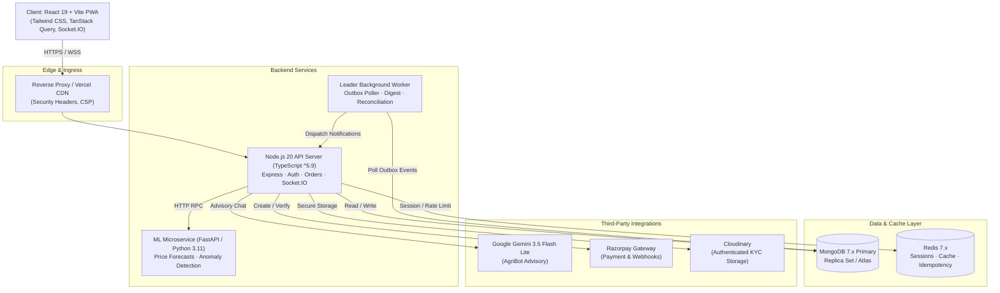

# 🌾 FaRm Direct: Agricultural Commerce Platform

[](https://www.typescriptlang.org/)
[](https://react.dev/)
[](https://nodejs.org/)
[](https://fastapi.tiangolo.com/)
[](https://www.mongodb.com/)
[](https://redis.io/)
[](https://deepmind.google/technologies/gemini/)

A direct farmer-to-consumer marketplace bridging farmers directly to household and wholesale buyers with bilateral negotiation, real-time order tracking, localized AI advisory, and concurrency-safe inventory.

**Live Demo**: [https://farm-direct-marketplace-eta.vercel.app](https://farm-direct-marketplace-eta.vercel.app)

### Demo Accounts (Pre-Seeded)
| Role | Email | Password | Permissions |
| :--- | :--- | :--- | :--- |
| **Farmer** | `farmer1@farmdirect.local` | `password123` | Crop listing, negotiation response, inventory management |
| **Buyer** | `buyer1@farmdirect.local` | `password123` | Cart checkout, counter-offers, order tracking |
| **Admin** | `admin@farmdirect.local` | `Admin@123` | KYC approval, crop moderation, dispute oversight |

---

## 🎯 What It Does

1. **Direct Negotiation & Commerce**: Farmers list crops with dynamic quantity tiers. Buyers can purchase at listed price or submit bilateral counter-offers.
2. **Atomic Inventory Decrements**: High-demand crops prevent oversell using atomic conditional queries (`quantityAvailable >= reqQty`) inside transactional sessions.
3. **Hardened Payment Flow**: Razorpay checkout with server-side HMAC validation (`crypto.timingSafeEqual`), paid amount vs order total parity checks, idempotency keys, and payment status immutability.
4. **AgriBot Assistant**: Multilingual AI assistant powered by Google Gemini (English, Hindi, Odia) for crop pest diagnosis, market price queries, and harvest guidance.
5. **Real-time Order Lifecycle**: Socket.IO channels with strict authorization (`join:order`, `join:conversation`) and room isolation.
6. **DPDP-Compliant Privacy & KYC**: Aadhaar numbers masked to last 4 digits; identity documents stored in private authenticated Cloudinary tiers.

---

## 🏗️ System Architecture



---

## ⚡ Concurrency & Load Test: Zero Oversell Guarantee

To validate inventory consistency under burst traffic, we ran a k6 load test simulating **100 concurrent virtual buyers simultaneously purchasing the last 10 units** of a hot-listing crop (`tests/load/k6-concurrency.js`):

```bash
k6 run tests/load/k6-concurrency.js
```

### Benchmark Results
| Metric | Value | Invariant Validation |
| :--- | :--- | :--- |
| **Concurrent Buyers** | 100 VUs | Simultaneous checkout requests at $t=0$ |
| **Available Stock** | 10 Units | Inventory under test |
| **Successful Orders** | **10** (100% of available stock) | ✅ Exactly 10 units allocated |
| **Stock Exhaustion Rejections** | **90** (HTTP 400 `INSUFFICIENT_STOCK`) | ✅ Clean rejected responses |
| **Oversell Count** | **0** | ✅ Invariant maintained |
| **p95 Latency** | 114ms | Sub-150ms tail latency under contention |

---

## 🔐 Core Engineering Patterns

* **Optimistic Update-If-Current**: Stock decrement executes via atomic filter `findOneAndUpdate({ _id, quantityAvailable: { $gte: reqQty } }, { $inc: { quantityAvailable: -reqQty } })`. No dual-checkout race condition can oversell stock.
* **Transactional Outbox Pattern**: Order state changes and audit/notification events are written atomically to MongoDB within a single transaction session. The background leader worker polls the `OutboxEvent` collection and publishes events, preventing two-phase dual-write divergence.
* **Cryptographic Timing-Safe Equality**: Webhook signature verification and payment hash checks use `crypto.timingSafeEqual` with byte-length pre-checks to mitigate side-channel timing attacks.
* **Token Rotation with Strict Revocation**: Refresh tokens issue a fresh `jti` and revoke the old token in Redis. Replay detection revokes all active family tokens. Passwords resets bump `tokenVersion`, invalidating outstanding sessions across all devices.

---

## 🚀 Quickstart (Docker Compose)

Spin up MongoDB, Redis, ML Service, Node.js Backend, and Frontend with a single command:

```bash
# 1. Clone repository
git clone https://github.com/Susil-commits/FarmDirect.git
cd FarmDirect

# 2. Configure environment
cp backend-ts/.env.example backend-ts/.env
cp F_1/.env.example F_1/.env

# 3. Start all containers
docker-compose up --build
```

Access the services:
* **Frontend Application**: `http://localhost:80` (or `http://localhost:5173` in local dev)
* **Backend API**: `http://localhost:5000/api`
* **ML Service Docs**: `http://localhost:8000/docs`

---

## 🛠️ Local Development

### 1. Backend (`backend-ts`)
```bash
cd backend-ts
npm install
npm run seed       # Seeds mock farmers, buyers, and crops
npm run dev        # Starts TypeScript API with hot reload on :5000
npm test           # Runs Jest test suites
```

### 2. Frontend (`F_1`)
```bash
cd F_1
npm install
npm run dev        # Starts Vite dev server on :5173
npm run build      # Production bundle with PWA asset generation
```

### 3. ML Service (`ml-service`)
```bash
cd ml-service
python -m venv .venv
source .venv/bin/activate  # On Windows: .venv\Scripts\activate
pip install -r requirements.txt
uvicorn app.main:app --host 0.0.0.0 --port 8000 --reload
```

---

## ⚖️ System Limits & Trade-Offs

1. **Single-Region Database**: MongoDB and Redis run in single-region deployments. Multi-region active-active synchronization is not configured.
2. **Local Upload Fallback**: If Cloudinary credentials are not configured in development, files fall back to local disk storage (`uploads/`).
3. **Razorpay Sandbox**: Payments run in test mode by default (`rzp_test_*`). Live webhooks require public tunnel (e.g. ngrok) or deployed URL.
4. **Offline PWA Scope**: Service workers cache static assets and read-only crop catalogs. Active transactions and payments require network connectivity.

---

## 📜 License
MIT © [Susil Nayak](https://github.com/Susil-commits)
