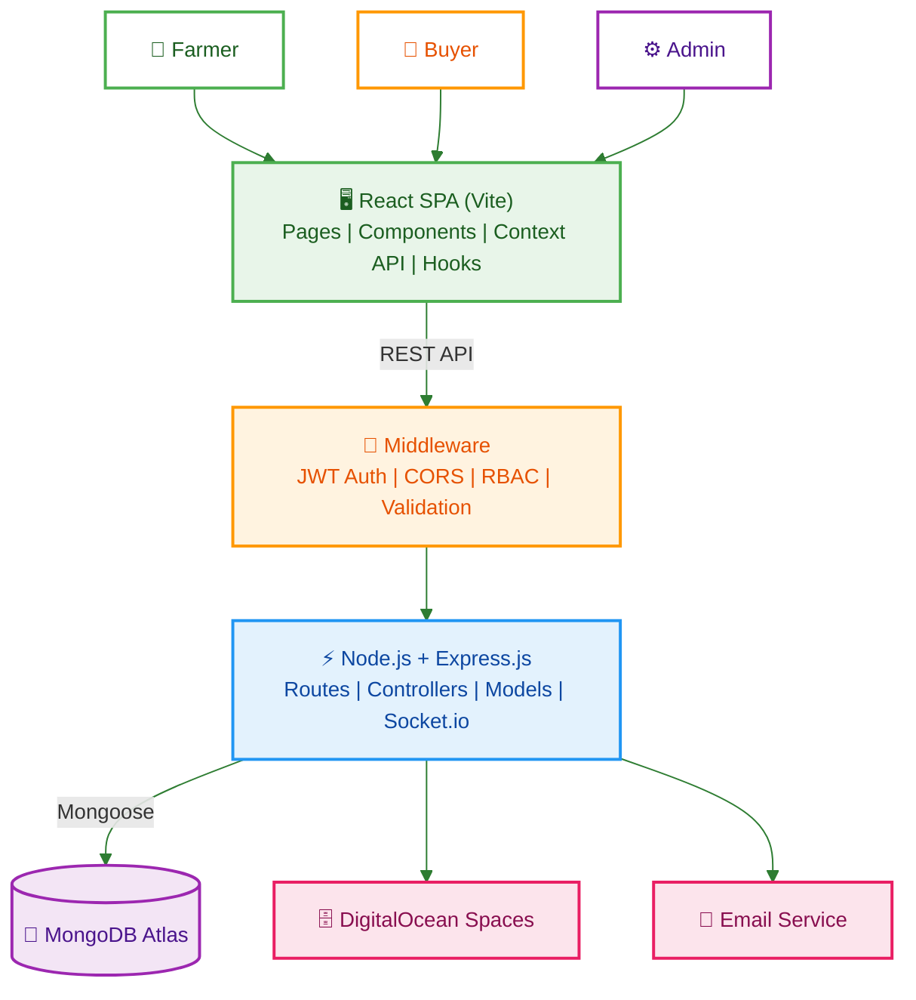
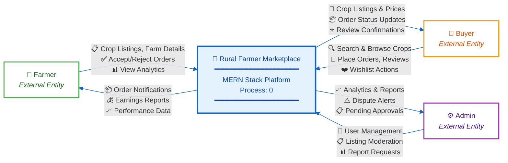
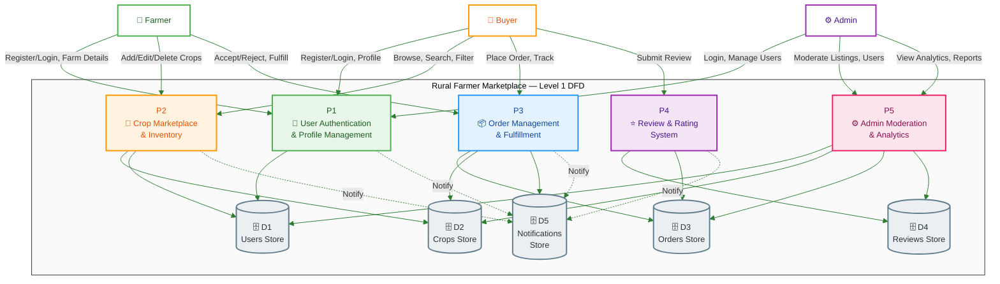
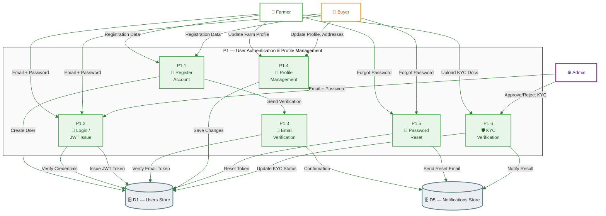
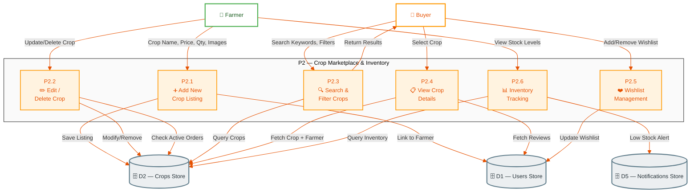
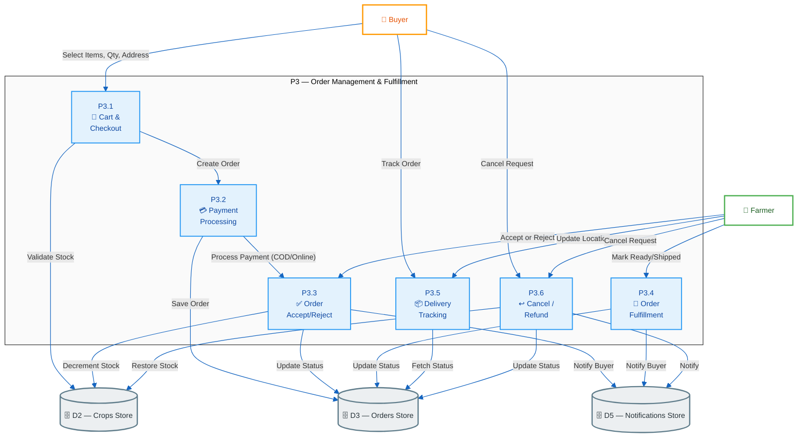
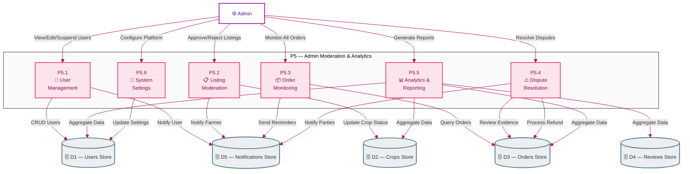
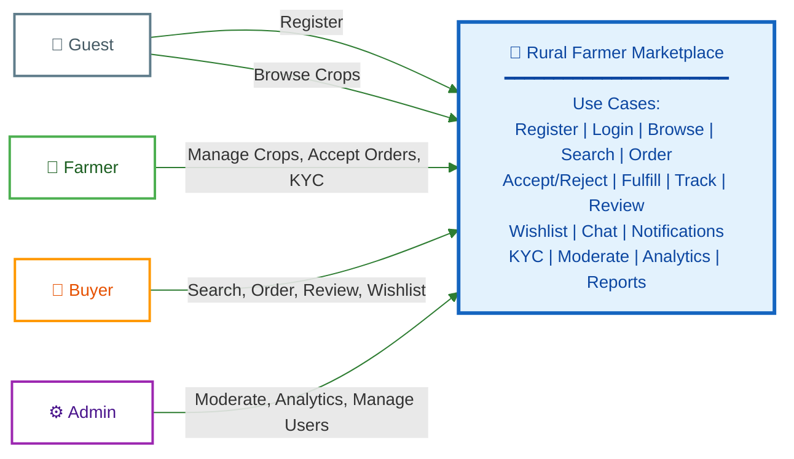

# Rural Farmer Marketplace — Diagrams Report

> **All diagrams use white background styling for clear visibility in printed reports and presentations.**

---

## Table of Contents

1. [System Architecture Diagram](#1-system-architecture-diagram)
2. [DFD Level 0 — Context Diagram](#2-dfd-level-0--context-diagram)
3. [DFD Level 1 — Major Processes](#3-dfd-level-1--major-processes)
4. [DFD Level 2 — Detailed Sub-Processes](#4-dfd-level-2--detailed-sub-processes)
   - [4.1 User Authentication (Process 1)](#41-user-authentication-process-1)
   - [4.2 Crop Marketplace (Process 2)](#42-crop-marketplace-process-2)
   - [4.3 Order Management (Process 3)](#43-order-management-process-3)
   - [4.4 Admin Moderation (Process 4)](#44-admin-moderation-process-4)
   - [4.5 Combined DFD Level 2 (Simplified)](#45-combined-dfd-level-2--all-sub-processes-simplified)
5. [Use Case Diagram](#5-use-case-diagram)
6. [Full System Test Cases](#6-full-system-test-cases)
   - [6.1 P1 — Auth & Profile](#61-p1--user-authentication--profile-management)
   - [6.2 P2 — Marketplace & Inventory](#62-p2--crop-marketplace--inventory)
   - [6.3 P3 — Order Management](#63-p3--order-management--fulfillment)
   - [6.4 P5 — Admin Moderation](#64-p5--admin-moderation--analytics)
   - [6.5 Cross-Process Integration](#65-cross-process-integration-tests)
7. [Summary of Diagrams](#summary-of-diagrams)

---

## 1. System Architecture Diagram

---

## 2. DFD Level 0 — Context Diagram

**The entire "Rural Farmer Marketplace" system as a single process, showing all external entities and data flows.**

---

## 3. DFD Level 1 — Major Processes

**Decomposition of the system into 5 major processes with data stores.**

---

## 4. DFD Level 2 — Detailed Sub-Processes

### 4.1 User Authentication (Process 1)

### 4.2 Crop Marketplace (Process 2)

### 4.3 Order Management (Process 3)

### 4.4 Admin Moderation (Process 5)

---

## 4.5 Combined DFD Level 2 — All Sub-Processes (Simplified)

```mermaid
%%{init: {'theme': 'default', 'themeVariables': { 'background': '#FFFFFF', 'primaryColor': '#E8F5E9', 'primaryTextColor': '#1B5E20', 'primaryBorderColor': '#4CAF50', 'lineColor': '#2E7D32', 'fontSize': '11px'}}}%%
graph TB
    FARMER["🌾 Farmer"]
    BUYER["🛒 Buyer"]
    ADMIN["⚙️ Admin"]

    subgraph P1["P1 — Auth & Profile"]
        P1_1["Register"]
        P1_2["Login / JWT"]
        P1_3["Email Verify"]
        P1_4["Profile Mgmt"]
        P1_5["Password Reset"]
        P1_6["KYC Verify"]
    end

    subgraph P2["P2 — Marketplace"]
        P2_1["Add Crop"]
        P2_2["Edit/Delete"]
        P2_3["Search & Filter"]
        P2_4["View Details"]
        P2_5["Wishlist"]
        P2_6["Inventory"]
    end

    subgraph P3["P3 — Orders"]
        P3_1["Cart/Checkout"]
        P3_2["Payment"]
        P3_3["Accept/Reject"]
        P3_4["Fulfillment"]
        P3_5["Tracking"]
        P3_6["Cancel/Refund"]
    end

    subgraph P5["P5 — Admin"]
        P5_1["User Mgmt"]
        P5_2["Listing Mod"]
        P5_3["Order Monitor"]
        P5_4["Disputes"]
        P5_5["Analytics"]
        P5_6["Settings"]
    end

    D1[("🗄️ D1 — Users")]
    D2[("🗄️ D2 — Crops")]
    D3[("🗄️ D3 — Orders")]
    D4[("🗄️ D4 — Reviews")]
    D5[("🗄️ D5 — Notifications")]

    FARMER --> P1_1 & P1_2 & P1_4 & P1_5 & P1_6
    BUYER --> P1_1 & P1_2 & P1_4 & P1_5
    ADMIN --> P1_2 & P1_6 & P5_1 & P5_2 & P5_3 & P5_4 & P5_5 & P5_6

    FARMER --> P2_1 & P2_2 & P2_6
    BUYER --> P2_3 & P2_4 & P2_5

    BUYER --> P3_1 & P3_5 & P3_6
    FARMER --> P3_3 & P3_4 & P3_6

    P1_1 & P1_2 & P1_3 & P1_4 & P1_5 & P1_6 --> D1
    P1_3 & P1_5 & P1_6 --> D5

    P2_1 & P2_2 & P2_3 & P2_4 & P2_6 --> D2
    P2_1 & P2_5 --> D1
    P2_6 --> D5

    P3_1 --> D2
    P3_2 & P3_3 & P3_4 & P3_5 & P3_6 --> D3
    P3_3 & P3_4 & P3_6 --> D5
    P3_3 & P3_6 --> D2

    P5_1 --> D1
    P5_2 --> D2
    P5_3 & P5_4 --> D3
    P5_4 --> D4
    P5_5 --> D1 & D2 & D3 & D4
    P5_6 --> D1
    P5_1 & P5_2 & P5_3 & P5_4 --> D5

    style FARMER fill:#FFFFFF,stroke:#4CAF50,stroke-width:2px,color:#1B5E20
    style BUYER fill:#FFFFFF,stroke:#FF9800,stroke-width:2px,color:#E65100
    style ADMIN fill:#FFFFFF,stroke:#9C27B0,stroke-width:2px,color:#4A148C
    style P1 fill:#E8F5E9,stroke:#4CAF50,stroke-width:1.5px,color:#1B5E20
    style P2 fill:#FFF3E0,stroke:#FF9800,stroke-width:1.5px,color:#E65100
    style P3 fill:#E3F2FD,stroke:#2196F3,stroke-width:1.5px,color:#0D47A1
    style P5 fill:#FCE4EC,stroke:#E91E63,stroke-width:1.5px,color:#880E4F
    style D1 fill:#ECEFF1,stroke:#607D8B,stroke-width:2px,color:#263238
    style D2 fill:#ECEFF1,stroke:#607D8B,stroke-width:2px,color:#263238
    style D3 fill:#ECEFF1,stroke:#607D8B,stroke-width:2px,color:#263238
    style D4 fill:#ECEFF1,stroke:#607D8B,stroke-width:2px,color:#263238
    style D5 fill:#ECEFF1,stroke:#607D8B,stroke-width:2px,color:#263238
```

---

## 5. Use Case Diagram

---

## Summary of Diagrams

| Diagram | Description | Section |
|---------|-------------|---------|
| **System Architecture** | 5-layer architecture: Users → Client → API Gateway → Backend → Database + External Services | §1 |
| **DFD Level 0** | Context diagram — entire system as one process with 3 external entities (Farmer, Buyer, Admin) | §2 |
| **DFD Level 1** | 5 major processes: Auth, Marketplace, Orders, Reviews, Admin + 5 data stores | §3 |
| **DFD Level 2** | Detailed decomposition of Auth (6 sub-processes), Marketplace (6), Orders (6), Admin (6) | §4 |
| **DFD Level 2 Combined** | Single simplified diagram merging all 4 DFD Level 2 sub-processes into one unified view | §4.5 |
| **Use Case Diagram** | 4 actors (Farmer, Buyer, Admin, Guest) with 30+ use cases across 8 functional groups | §5 |

---

> **Note:** All diagrams use Mermaid syntax with explicit white background (`#FFFFFF`) styling. To export as images, use the Mermaid Live Editor ([mermaid.live](https://mermaid.live)) or the VS Code "Markdown Preview Mermaid Support" extension. For PDF reports, render the markdown with a Mermaid-compatible tool like `mermaid-filter` (pandoc) or export each diagram as SVG/PNG from mermaid.live.

---

## 6. Full System Test Cases

### 6.1 P1 — User Authentication & Profile Management

| TC-ID | Sub-Process | Test Case | Actor | Precondition | Steps | Expected Result | Priority |
|-------|------------|-----------|-------|-------------|-------|-----------------|----------|
| TC-AUTH-01 | P1.1 Register | Farmer registration with valid data | 🌾 Farmer | Not logged in | 1. Navigate to Register 2. Fill name, email, phone, password, farm details 3. Submit | Account created; verification email sent; redirect to login | 🔴 High |
| TC-AUTH-02 | P1.1 Register | Buyer registration with valid data | 🛒 Buyer | Not logged in | 1. Navigate to Register 2. Fill name, email, phone, password 3. Submit | Account created; verification email sent; redirect to login | 🔴 High |
| TC-AUTH-03 | P1.1 Register | Duplicate email registration | 🌾 Farmer | Existing user with same email | 1. Register with already-used email 2. Submit | Error: "Email already registered" | 🟡 Medium |
| TC-AUTH-04 | P1.1 Register | Registration with invalid phone format | 🛒 Buyer | Not logged in | 1. Enter invalid phone (e.g., "abc") 2. Submit | Validation error: "Invalid phone number" | 🟡 Medium |
| TC-AUTH-05 | P1.2 Login | Valid farmer login | 🌾 Farmer | Registered & verified | 1. Enter email + password 2. Click Login | JWT token issued; redirect to Farmer Dashboard | 🔴 High |
| TC-AUTH-06 | P1.2 Login | Valid buyer login | 🛒 Buyer | Registered & verified | 1. Enter email + password 2. Click Login | JWT token issued; redirect to Marketplace | 🔴 High |
| TC-AUTH-07 | P1.2 Login | Valid admin login | ⚙️ Admin | Admin account exists | 1. Enter admin email + password 2. Click Login | JWT token issued; redirect to Admin Panel | 🔴 High |
| TC-AUTH-08 | P1.2 Login | Invalid password | 🛒 Buyer | Registered | 1. Enter correct email + wrong password 2. Click Login | Error: "Invalid credentials" | 🔴 High |
| TC-AUTH-09 | P1.2 Login | Unverified account login | 🌾 Farmer | Registered but email not verified | 1. Enter email + password 2. Click Login | Error: "Please verify your email first" | 🟡 Medium |
| TC-AUTH-10 | P1.3 Email Verify | Click valid verification link | 🌾 Farmer | Registered, token not expired | 1. Open email 2. Click verification link | Account verified; confirmation notification shown | 🔴 High |
| TC-AUTH-11 | P1.3 Email Verify | Expired verification token | 🛒 Buyer | Registered, token expired | 1. Click expired verification link | Error: "Token expired. Request new verification" | 🟡 Medium |
| TC-AUTH-12 | P1.4 Profile Mgmt | Farmer updates farm profile | 🌾 Farmer | Logged in as farmer | 1. Go to Profile 2. Update farm name, address, description 3. Save | Profile updated; success toast shown | 🟡 Medium |
| TC-AUTH-13 | P1.4 Profile Mgmt | Buyer adds delivery address | 🛒 Buyer | Logged in as buyer | 1. Go to Profile → Addresses 2. Add new address 3. Save | Address saved; appears in address list | 🟡 Medium |
| TC-AUTH-14 | P1.4 Profile Mgmt | Upload profile photo | 🛒 Buyer | Logged in | 1. Go to Profile 2. Upload photo (JPG, <5MB) 3. Save | Photo uploaded; displayed on profile | 🟢 Low |
| TC-AUTH-15 | P1.5 Password Reset | Request password reset | 🌾 Farmer | Registered, not logged in | 1. Click "Forgot Password" 2. Enter registered email 3. Submit | Reset email sent with token link | 🔴 High |
| TC-AUTH-16 | P1.5 Password Reset | Reset with valid token | 🛒 Buyer | Received reset email | 1. Click reset link 2. Enter new password 3. Submit | Password updated; redirect to login | 🔴 High |
| TC-AUTH-17 | P1.5 Password Reset | Reset with expired token | 🌾 Farmer | Token expired | 1. Click expired reset link 2. Enter new password | Error: "Token expired. Request again" | 🟡 Medium |
| TC-AUTH-18 | P1.6 KYC Verify | Farmer uploads KYC documents | 🌾 Farmer | Logged in, KYC not submitted | 1. Go to KYC section 2. Upload Aadhaar + farm proof 3. Submit | Documents uploaded; status = "Pending" | 🔴 High |
| TC-AUTH-19 | P1.6 KYC Verify | Admin approves KYC | ⚙️ Admin | KYC pending in queue | 1. Open Admin → KYC Queue 2. Review documents 3. Click Approve | Farmer KYC status = "Verified"; notification sent | 🔴 High |
| TC-AUTH-20 | P1.6 KYC Verify | Admin rejects KYC with reason | ⚙️ Admin | KYC pending in queue | 1. Open Admin → KYC Queue 2. Review documents 3. Click Reject + enter reason | Farmer KYC status = "Rejected"; notification with reason sent | 🟡 Medium |

### 6.2 P2 — Crop Marketplace & Inventory

| TC-ID | Sub-Process | Test Case | Actor | Precondition | Steps | Expected Result | Priority |
|-------|------------|-----------|-------|-------------|-------|-----------------|----------|
| TC-MKT-01 | P2.1 Add Crop | Farmer adds crop with images | 🌾 Farmer | Logged in, KYC verified | 1. Go to "Add Crop" 2. Fill name, category, price, quantity, unit 3. Upload 2–5 images 4. Submit | Crop listing created; appears in marketplace | 🔴 High |
| TC-MKT-02 | P2.1 Add Crop | Add crop with missing required fields | 🌾 Farmer | Logged in, KYC verified | 1. Go to "Add Crop" 2. Leave price empty 3. Submit | Validation error: "Price is required" | 🟡 Medium |
| TC-MKT-03 | P2.1 Add Crop | Add crop without KYC verification | 🌾 Farmer | Logged in, KYC not verified | 1. Try to add crop | Error: "KYC verification required to list crops" | 🔴 High |
| TC-MKT-04 | P2.2 Edit Crop | Farmer edits crop price & quantity | 🌾 Farmer | Owns an active listing | 1. Go to My Listings 2. Edit price from ₹50 → ₹45 3. Save | Listing updated; new price reflected | 🟡 Medium |
| TC-MKT-05 | P2.2 Edit Crop | Farmer deletes a crop with no active orders | 🌾 Farmer | Owns listing with no orders | 1. Go to My Listings 2. Click Delete on a crop 3. Confirm | Listing removed from marketplace | 🟡 Medium |
| TC-MKT-06 | P2.2 Edit Crop | Farmer tries to delete crop with active orders | 🌾 Farmer | Owns listing with pending orders | 1. Try to delete crop | Error: "Cannot delete — active orders exist" | 🔴 High |
| TC-MKT-07 | P2.3 Search | Buyer searches by crop name | 🛒 Buyer | On marketplace page | 1. Type "Wheat" in search bar 2. Press Enter | Results show only wheat listings | 🔴 High |
| TC-MKT-08 | P2.3 Search | Buyer filters by price range | 🛒 Buyer | On marketplace page | 1. Set price filter: ₹20–₹50 2. Apply | Only crops in ₹20–₹50 range shown | 🟡 Medium |
| TC-MKT-09 | P2.3 Search | Buyer filters by category | 🛒 Buyer | On marketplace page | 1. Select category "Vegetables" 2. Apply | Only vegetable listings shown | 🟡 Medium |
| TC-MKT-10 | P2.3 Search | Combined search + filter | 🛒 Buyer | On marketplace page | 1. Search "Tomato" 2. Filter by location 3. Apply | Tomatoes from selected location only | 🟢 Low |
| TC-MKT-11 | P2.3 Search | Search with no results | 🛒 Buyer | On marketplace page | 1. Search "xyzabc123" | "No crops found" message displayed | 🟢 Low |
| TC-MKT-12 | P2.4 View Details | Buyer views crop detail page | 🛒 Buyer | Crop listing exists | 1. Click on a crop card 2. View detail page | Full details: images, price, farmer info, reviews shown | 🔴 High |
| TC-MKT-13 | P2.4 View Details | View crop with farmer contact | 🛒 Buyer | Crop detail page open | 1. Scroll to farmer section | Farmer name, rating, location, contact option visible | 🟡 Medium |
| TC-MKT-14 | P2.5 Wishlist | Buyer adds crop to wishlist | 🛒 Buyer | Logged in, viewing crop | 1. Click ❤️ (heart) icon on crop 2. Confirm | Crop added to wishlist; heart turns filled | 🟡 Medium |
| TC-MKT-15 | P2.5 Wishlist | Buyer removes crop from wishlist | 🛒 Buyer | Crop already in wishlist | 1. Click ❤️ again on wishlisted crop | Crop removed from wishlist; heart turns outline | 🟢 Low |
| TC-MKT-16 | P2.5 Wishlist | Guest tries to add to wishlist | 👤 Guest | Not logged in | 1. Click ❤️ on crop | Login prompt shown | 🟡 Medium |
| TC-MKT-17 | P2.6 Inventory | Farmer views stock levels | 🌾 Farmer | Has active listings | 1. Go to Dashboard → Inventory | All listings with current stock quantities shown | 🟡 Medium |
| TC-MKT-18 | P2.6 Inventory | Low stock alert triggered | 🌾 Farmer | Crop quantity drops below threshold | 1. Orders reduce stock to <10% | Low stock notification sent to farmer | 🟡 Medium |
| TC-MKT-19 | P2.6 Inventory | Out of stock auto-hide | 🌾 Farmer | Crop quantity reaches 0 | 1. Last unit ordered | Listing hidden from marketplace; farmer notified | 🔴 High |

### 6.3 P3 — Order Management & Fulfillment

| TC-ID | Sub-Process | Test Case | Actor | Precondition | Steps | Expected Result | Priority |
|-------|------------|-----------|-------|-------------|-------|-----------------|----------|
| TC-ORD-01 | P3.1 Cart | Buyer adds item to cart | 🛒 Buyer | Logged in, crop in stock | 1. View crop detail 2. Select quantity: 5 kg 3. Click "Add to Cart" | Item added; cart badge updates; mini-cart shows item | 🔴 High |
| TC-ORD-02 | P3.1 Cart | Buyer updates quantity in cart | 🛒 Buyer | Item in cart | 1. Open cart 2. Change qty from 5 → 10 kg 3. Update | Cart total recalculated; stock validation passes | 🟡 Medium |
| TC-ORD-03 | P3.1 Cart | Quantity exceeds available stock | 🛒 Buyer | Item in cart, stock = 8 kg | 1. Try to set qty to 15 kg | Error: "Only 8 kg available" | 🟡 Medium |
| TC-ORD-04 | P3.1 Checkout | Complete checkout with delivery address | 🛒 Buyer | Items in cart, address saved | 1. Go to Cart → Checkout 2. Select delivery address 3. Choose payment method 4. Place Order | Order created; order confirmation page shown | 🔴 High |
| TC-ORD-05 | P3.1 Checkout | Checkout with empty cart | 🛒 Buyer | Cart is empty | 1. Try to checkout | Redirected to marketplace with "Cart is empty" message | 🟡 Medium |
| TC-ORD-06 | P3.2 Payment | COD (Cash on Delivery) order | 🛒 Buyer | At checkout | 1. Select "Cash on Delivery" 2. Place order | Order created with status "Pending Confirmation"; no online payment | 🔴 High |
| TC-ORD-07 | P3.2 Payment | Online payment simulation | 🛒 Buyer | At checkout | 1. Select "Online Payment" 2. Complete mock payment gateway 3. Return to app | Order created with status "Payment Confirmed" | 🔴 High |
| TC-ORD-08 | P3.2 Payment | Payment failure handling | 🛒 Buyer | At checkout, online payment | 1. Select online payment 2. Payment fails | Order saved as "Payment Failed"; user can retry | 🟡 Medium |
| TC-ORD-09 | P3.3 Accept/Reject | Farmer accepts order | 🌾 Farmer | New order received | 1. Open Orders → Pending 2. Click "Accept" on order 3. Confirm | Order status = "Accepted"; buyer notified; stock decremented | 🔴 High |
| TC-ORD-10 | P3.3 Accept/Reject | Farmer rejects order with reason | 🌾 Farmer | New order received | 1. Open Orders → Pending 2. Click "Reject" 3. Enter reason: "Stock damaged" 4. Confirm | Order status = "Rejected"; buyer notified with reason | 🔴 High |
| TC-ORD-11 | P3.3 Accept/Reject | Auto-reject after timeout | System | Order pending > 48 hours | 1. No farmer action for 48h | Order auto-rejected; both parties notified | 🟡 Medium |
| TC-ORD-12 | P3.4 Fulfillment | Farmer marks order as ready | 🌾 Farmer | Order accepted | 1. Open accepted order 2. Click "Mark Ready" | Order status = "Ready for Pickup"; buyer notified | 🟡 Medium |
| TC-ORD-13 | P3.4 Fulfillment | Farmer marks order as shipped | 🌾 Farmer | Order ready | 1. Open ready order 2. Click "Mark Shipped" 3. Enter dispatch details | Order status = "Shipped"; tracking available; buyer notified | 🔴 High |
| TC-ORD-14 | P3.5 Tracking | Buyer tracks order status | 🛒 Buyer | Order placed & accepted | 1. Go to My Orders 2. Click "Track" on order | Status timeline: Placed → Accepted → Ready → Shipped → Delivered | 🔴 High |
| TC-ORD-15 | P3.5 Tracking | Farmer updates delivery location | 🌾 Farmer | Order shipped | 1. Update current location 2. Save | Location updated on tracking map for buyer | 🟢 Low |
| TC-ORD-16 | P3.5 Tracking | Order delivered confirmation | 🛒 Buyer | Order shipped | 1. Receive delivery 2. Click "Confirm Delivery" | Order status = "Delivered"; farmer notified | 🔴 High |
| TC-ORD-17 | P3.6 Cancel | Buyer cancels before acceptance | 🛒 Buyer | Order pending (not yet accepted) | 1. Open order 2. Click "Cancel Order" 3. Confirm | Order cancelled; farmer notified | 🟡 Medium |
| TC-ORD-18 | P3.6 Cancel | Buyer cancels after acceptance | 🛒 Buyer | Order accepted, not shipped | 1. Request cancellation 2. Enter reason | Cancellation request sent to farmer for approval | 🟡 Medium |
| TC-ORD-19 | P3.6 Cancel | Farmer cancels due to stock issue | 🌾 Farmer | Order accepted | 1. Open order 2. Click "Cancel" 3. Reason: "Crop damaged" | Order cancelled; stock restored; buyer notified + refund initiated | 🔴 High |
| TC-ORD-20 | P3.6 Refund | Refund processed after cancellation | System | Order cancelled after payment | 1. Cancellation confirmed | Refund initiated; amount returned to buyer; both notified | 🔴 High |

### 6.4 P5 — Admin Moderation & Analytics

| TC-ID | Sub-Process | Test Case | Actor | Precondition | Steps | Expected Result | Priority |
|-------|------------|-----------|-------|-------------|-------|-----------------|----------|
| TC-ADM-01 | P5.1 User Mgmt | Admin views all users | ⚙️ Admin | Logged in as admin | 1. Go to Admin → Users 2. Browse user list | All users listed with role, status, join date | 🔴 High |
| TC-ADM-02 | P5.1 User Mgmt | Admin suspends a user | ⚙️ Admin | Active user exists | 1. Find user 2. Click "Suspend" 3. Enter reason 4. Confirm | User suspended; cannot login; notification sent | 🔴 High |
| TC-ADM-03 | P5.1 User Mgmt | Admin reactivates suspended user | ⚙️ Admin | Suspended user exists | 1. Find suspended user 2. Click "Reactivate" | User can login again; notification sent | 🟡 Medium |
| TC-ADM-04 | P5.1 User Mgmt | Admin edits user role | ⚙️ Admin | User exists | 1. Change role from Buyer → Farmer 2. Save | Role updated; user gets farmer permissions | 🟡 Medium |
| TC-ADM-05 | P5.2 Listing Mod | Admin approves a new crop listing | ⚙️ Admin | New listing pending review | 1. Go to Admin → Listings 2. Review crop details 3. Click "Approve" | Listing visible in marketplace; farmer notified | 🔴 High |
| TC-ADM-06 | P5.2 Listing Mod | Admin rejects inappropriate listing | ⚙️ Admin | Listing pending review | 1. Review listing 2. Click "Reject" 3. Reason: "Inappropriate content" | Listing hidden; farmer notified with reason | 🟡 Medium |
| TC-ADM-07 | P5.2 Listing Mod | Admin flags listing for revision | ⚙️ Admin | Listing pending review | 1. Click "Request Changes" 2. Enter feedback | Listing status = "Revision Needed"; farmer can edit & resubmit | 🟢 Low |
| TC-ADM-08 | P5.3 Order Monitor | Admin views all orders | ⚙️ Admin | Orders exist in system | 1. Go to Admin → Orders 2. Filter by status | All orders with status, buyer, farmer, amount visible | 🔴 High |
| TC-ADM-09 | P5.3 Order Monitor | Admin sends reminder for stale order | ⚙️ Admin | Order pending > 24h | 1. Find stale order 2. Click "Send Reminder" | Reminder notification sent to farmer | 🟡 Medium |
| TC-ADM-10 | P5.3 Order Monitor | Admin force-cancels fraudulent order | ⚙️ Admin | Suspicious order detected | 1. Open order 2. Click "Force Cancel" 3. Enter reason | Order cancelled; both parties notified; funds held/reversed | 🔴 High |
| TC-ADM-11 | P5.4 Disputes | Admin reviews dispute evidence | ⚙️ Admin | Dispute raised by buyer/farmer | 1. Go to Admin → Disputes 2. Open dispute 3. Review chat, order history, evidence | Full dispute context visible | 🔴 High |
| TC-ADM-12 | P5.4 Disputes | Admin resolves dispute in buyer's favor | ⚙️ Admin | Dispute under review | 1. Review evidence 2. Rule in favor of buyer 3. Process refund | Refund issued; order closed; both notified | 🔴 High |
| TC-ADM-13 | P5.4 Disputes | Admin resolves dispute in farmer's favor | ⚙️ Admin | Dispute under review | 1. Review evidence 2. Rule in favor of farmer 3. Release payment | Payment released to farmer; order closed; both notified | 🟡 Medium |
| TC-ADM-14 | P5.5 Analytics | Admin views dashboard overview | ⚙️ Admin | Data exists | 1. Go to Admin → Dashboard | Charts: total users, orders, revenue, top crops, active farmers | 🔴 High |
| TC-ADM-15 | P5.5 Analytics | Admin generates sales report | ⚙️ Admin | Orders data exists | 1. Go to Analytics → Reports 2. Select date range 3. Click "Generate" | Report with total sales, orders, commission, top sellers | 🟡 Medium |
| TC-ADM-16 | P5.5 Analytics | Admin exports report as CSV | ⚙️ Admin | Report generated | 1. Click "Export CSV" | CSV file downloaded with report data | 🟢 Low |
| TC-ADM-17 | P5.5 Analytics | Admin views farmer performance | ⚙️ Admin | Multiple farmers with orders | 1. Go to Analytics → Farmers 2. Sort by rating/sales | Farmers ranked by performance metrics | 🟢 Low |
| TC-ADM-18 | P5.6 Settings | Admin updates platform commission rate | ⚙️ Admin | Logged in as admin | 1. Go to Settings 2. Change commission from 5% → 7% 3. Save | New rate applied to future orders; existing orders unaffected | 🟡 Medium |
| TC-ADM-19 | P5.6 Settings | Admin configures notification templates | ⚙️ Admin | Logged in as admin | 1. Go to Settings → Notifications 2. Edit order confirmation template 3. Save | Updated template used for new notifications | 🟢 Low |
| TC-ADM-20 | P5.6 Settings | Admin manages banned keywords | ⚙️ Admin | Logged in as admin | 1. Go to Settings → Moderation 2. Add banned keyword 3. Save | Listings with banned keywords auto-flagged | 🟡 Medium |

### 6.5 Cross-Process Integration Tests

| TC-ID | Sub-Process | Test Case | Actor | Precondition | Steps | Expected Result | Priority |
|-------|------------|-----------|-------|-------------|-------|-----------------|----------|
| TC-INT-01 | P1→P2 | Farmer registers, verifies KYC, lists crop | 🌾 Farmer | New user | 1. Register (P1.1) 2. Verify email (P1.3) 3. Upload KYC (P1.6) 4. Admin approves KYC (P1.6) 5. Add crop (P2.1) | Full flow: registration → KYC → listing live | 🔴 High |
| TC-INT-02 | P2→P3 | Buyer searches, adds to cart, orders | 🛒 Buyer | Logged in, crops available | 1. Search crop (P2.3) 2. View details (P2.4) 3. Add to cart (P3.1) 4. Checkout + pay (P3.1, P3.2) | End-to-end purchase flow complete | 🔴 High |
| TC-INT-03 | P3→P5 | Order dispute escalation to admin | 🛒 Buyer → ⚙️ Admin | Order delivered, buyer unhappy | 1. Buyer raises dispute (P3.6) 2. Admin reviews (P5.4) 3. Admin resolves + refunds (P5.4) | Dispute resolved; refund processed | 🔴 High |
| TC-INT-04 | P1→P3→P5 | Full order lifecycle with admin oversight | All | System operational | 1. Buyer orders (P3.1) 2. Farmer accepts (P3.3) 3. Farmer ships (P3.4) 4. Buyer tracks (P3.5) 5. Delivery confirmed (P3.5) 6. Admin monitors (P5.3) | Complete order lifecycle tracked end-to-end | 🔴 High |
| TC-INT-05 | P2→P5 | Admin moderates listing, farmer resubmits | 🌾 Farmer → ⚙️ Admin | Farmer listed crop | 1. Farmer adds crop (P2.1) 2. Admin rejects with feedback (P5.2) 3. Farmer edits & resubmits (P2.2) 4. Admin approves (P5.2) | Listing approved after revision cycle | 🟡 Medium |
| TC-INT-06 | All | Concurrent users — load test | 50 Farmers + 200 Buyers | System operational | 1. Multiple farmers list crops 2. Multiple buyers search & order 3. Admin monitors | System handles concurrent operations without data corruption | 🔴 High |

---

> **Test Case Summary:** 80 total test cases — 20 Auth, 19 Marketplace, 20 Orders, 20 Admin, 6 Integration | Priority: 🔴 38 High · 🟡 30 Medium · 🟢 12 Low