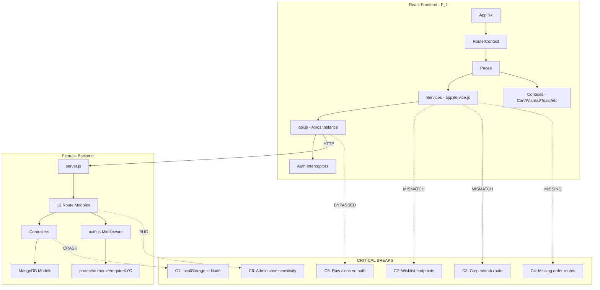

# FaRm (FarmDirect) — Perfect Finishing Remediation Plan

**Date**: May 13, 2026  
**Current Status**: ~95% complete (per IMPLEMENTATION_PROGRESS.md)  
**Goal**: Fix all system-breaking bugs, API mismatches, and quality issues to achieve production-ready state

---

## Summary of Findings

After a thorough cross-reference of all backend routes/controllers against frontend services/pages, **18 distinct issues** were identified across 4 severity tiers. The most critical are **API endpoint mismatches** between frontend services and backend routes that will cause runtime failures, and a **`localStorage` reference in Node.js** that will crash the server.

---

## 🔴 CRITICAL — System Breaking (Will Crash or Block Core Features)

### C1. `localStorage.token` in Node.js → ReferenceError

- **File**: [`backend/controllers/authController.js`](backend/controllers/authController.js:207)
- **Problem**: `updateProfile` function references `localStorage.token` on line 207. `localStorage` is a browser API and does not exist in Node.js. Calling this endpoint will throw `ReferenceError: localStorage is not defined`.
- **Fix**: Replace `localStorage.token || generateToken(user._id)` with just `generateToken(user._id)`.

```diff
- token: localStorage.token || generateToken(user._id),
+ token: generateToken(user._id),
```

---

### C2. Wishlist API Endpoint Mismatches (2 endpoints)

- **File**: [`F_1/src/services/appService.js`](F_1/src/services/appService.js:66-68)
- **Problem A**: `addToWishlist(cropId)` calls `POST /wishlist/${cropId}` but backend [`wishlistRoutes.js`](backend/routes/wishlistRoutes.js:13) expects `POST /wishlist` with body `{cropId}`.
- **Problem B**: `isInWishlist(cropId)` calls `GET /wishlist/item/${cropId}` but backend [`wishlistRoutes.js`](backend/routes/wishlistRoutes.js:16) has `GET /wishlist/check/:cropId`.
- **Fix A**: Change frontend to `api.post('/wishlist', { cropId })`.
- **Fix B**: Change frontend to `api.get(`/wishlist/check/${cropId}`)`.

```diff
// appService.js wishlistService
- addToWishlist: (cropId) => api.post(`/wishlist/${cropId}`, {}),
+ addToWishlist: (cropId) => api.post('/wishlist', { cropId }),
- isInWishlist: (cropId) => api.get(`/wishlist/item/${cropId}`)
+ isInWishlist: (cropId) => api.get(`/wishlist/check/${cropId}`)
```

---

### C3. Crop Search Endpoint Mismatch

- **File**: [`F_1/src/services/appService.js`](F_1/src/services/appService.js:36)
- **Problem**: `cropService.searchCrops()` calls `GET /crops/search` but [`cropRoutes.js`](backend/routes/cropRoutes.js) has NO search route. The search endpoint actually lives in [`dataAccessRoutes.js`](backend/routes/dataAccessRoutes.js:14) at `GET /api/data/crops/search`.
- **Fix**: Change frontend to `api.get('/data/crops/search', { params: { q: query, ...filters } })`.

```diff
- searchCrops: (query, filters) => api.get('/crops/search', { params: { q: query, ...filters } }),
+ searchCrops: (query, filters) => api.get('/data/crops/search', { params: { q: query, ...filters } }),
```

---

### C4. Missing Order Routes (4 endpoints)

- **File**: [`F_1/src/services/appService.js`](F_1/src/services/appService.js:47-53)
- **Problem**: Frontend calls 4 order endpoints that don't exist in [`orderRoutes.js`](backend/routes/orderRoutes.js):
  | Frontend Call | Missing Route |
  |---|---|
  | `PATCH /orders/${id}/cancel` | No cancel route |
  | `GET /orders/${id}/status` | No status route |
  | `GET /orders/${id}/track` | No track route |
  | `GET /orders/payment/pending-cod` | No pending-cod route |

- **Fix**: Add these routes to [`orderRoutes.js`](backend/routes/orderRoutes.js) and corresponding controller functions to [`orderController.js`](backend/controllers/orderController.js):

```js
// In orderRoutes.js — add:
router.patch('/:id/cancel', protect, cancelOrder);
router.get('/:id/status', protect, getOrderStatus);
router.get('/:id/track', protect, trackOrder);
router.get('/payment/pending-cod', protect, authorize('admin', 'farmer'), getPendingCODPayments);
```

```js
// In orderController.js — add these controller functions:

// Cancel order (buyer only, only if not yet delivered)
export const cancelOrder = async (req, res, next) => {
  try {
    const order = await Order.findById(req.params.id);
    if (!order) return res.status(404).json({ message: 'Order not found' });
    if (order.buyerId.toString() !== req.user._id.toString()) {
      return res.status(403).json({ message: 'Not authorized' });
    }
    if (['delivered', 'cancelled'].includes(order.orderStatus)) {
      return res.status(400).json({ message: 'Cannot cancel this order' });
    }
    order.orderStatus = 'cancelled';
    order.timeline.push({ event: 'CANCELLED', description: 'Order cancelled by buyer', timestamp: new Date() });
    await order.save();
    res.status(200).json({ message: 'Order cancelled', order });
  } catch (error) { next(error); }
};

// Get order status summary
export const getOrderStatus = async (req, res, next) => {
  try {
    const order = await Order.findById(req.params.id).select('orderStatus orderNumber timeline');
    if (!order) return res.status(404).json({ message: 'Order not found' });
    res.status(200).json({ status: order.orderStatus, orderNumber: order.orderNumber, timeline: order.timeline });
  } catch (error) { next(error); }
};

// Track order (alias for getOrderById with limited fields)
export const trackOrder = async (req, res, next) => {
  try {
    const order = await Order.findById(req.params.id)
      .select('orderNumber orderStatus timeline deliveryAddress estimatedDelivery paymentStatus')
      .populate('items.farmerId', 'name phone');
    if (!order) return res.status(404).json({ message: 'Order not found' });
    res.status(200).json({ order });
  } catch (error) { next(error); }
};

// Get pending COD payments
export const getPendingCODPayments = async (req, res, next) => {
  try {
    const query = { paymentMethod: 'cod', paymentStatus: 'pending' };
    if (req.user.role === 'farmer') query['items.farmerId'] = req.user._id;
    const orders = await Order.find(query).populate('buyerId', 'name phone');
    res.status(200).json({ orders });
  } catch (error) { next(error); }
};
```

---

### C5. ImageUpload Uses Raw Axios (No Auth Headers)

- **File**: [`F_1/src/components/common/ImageUpload.jsx`](F_1/src/components/common/ImageUpload.jsx:3,74)
- **Problem**: Imports raw `axios` (line 3) and uses `axios.post()` (line 74) instead of the configured `api` instance from [`api.js`](F_1/src/services/api.js). This means no JWT auth token is attached, so any authenticated upload will fail with 401.
- **Fix**: Replace `import axios from 'axios'` with `import api from '../../services/api.js'` and change `axios.post(...)` to `api.post(...)`.

```diff
- import axios from 'axios';
+ import api from '../../services/api.js';

- const response = await axios.post(
-   `${process.env.REACT_APP_API_URL || 'http://localhost:5000'}/api/upload`,
+ const response = await api.post('/upload',
```

---

### C6. Contact Routes Authorization — Case Sensitivity Bug

- **File**: [`backend/routes/contactRoutes.js`](backend/routes/contactRoutes.js:20)
- **Problem**: `router.use(authorize('Admin'))` uses capital 'A'. The [`authorize` middleware](backend/middleware/auth.js:53) compares `req.user.role` which is always lowercase (`'admin'`). This means **all admin contact routes will return 403 Forbidden**.
- **Fix**: Change `'Admin'` to `'admin'`.

```diff
- router.use(authorize('Admin'));
+ router.use(authorize('admin'));
```

---

## 🟠 HIGH — Feature Breaking (Specific Features Won't Work)

### H1. CropDetail.jsx Fetches Wrong Farmer Endpoint

- **File**: [`F_1/src/pages/CropDetail.jsx`](F_1/src/pages/CropDetail.jsx:72-83)
- **Problem**: Uses `userService.getUserProfile(farmerId)` which calls `GET /users/profile` — this returns the **currently authenticated user**, not the farmer. Should use `userService.getFarmerProfile(farmerId)` which calls `GET /users/farmer/:farmerId`.
- **Fix**: Replace the call.

```diff
- const farmerData = await userService.getUserProfile(farmerId);
+ const farmerData = await userService.getFarmerProfile(farmerId);
```

---

### H2. Marketplace.jsx Uses Admin-Only Endpoint for Public Stats

- **File**: [`F_1/src/pages/Marketplace.jsx`](F_1/src/pages/Marketplace.jsx:69-84)
- **Problem**: `fetchStats()` calls `adminService.getUsers()` which requires admin authentication. Regular unauthenticated users browsing the marketplace will get a 403 error. The stats should come from a public endpoint.
- **Fix**: Use the public community stats endpoint `GET /users/community/stats` instead, or create a dedicated public stats endpoint. Add a fallback to hardcoded defaults if the call fails.

```diff
  const fetchStats = async () => {
    try {
-     const response = await adminService.getUsers();
-     // ... process admin response
+     const response = await api.get('/users/community/stats');
+     const data = response.data?.data || response.data || {};
+     setMarketplaceStats({
+       farmers: data.totalFarmers || 0,
+       products: data.totalCrops || 0,
+       reviews: data.totalReviews || 0,
+     });
    } catch (_err) {
      // Fallback to defaults for unauthenticated users
      setMarketplaceStats({ farmers: 0, products: 0, reviews: 0 });
    }
  };
```

---

### H3. updateOrderStatus Uses Wrong Field Name

- **File**: [`backend/controllers/orderController.js`](backend/controllers/orderController.js:193)
- **Problem**: `order.status = status` — the Order model uses `orderStatus`, not `status`. This will silently fail to update the order status.
- **Fix**: Change to `order.orderStatus = status`.

```diff
- order.status = status;
+ order.orderStatus = status;
```

---

### H4. adminApprovalOrder Double Assignment (Dead Code)

- **File**: [`backend/controllers/orderController.js`](backend/controllers/orderController.js:322-323)
- **Problem**: Two consecutive assignments — `order.orderStatus = 'admin_approved'` is immediately overwritten by `order.orderStatus = 'ready_for_delivery'`. The `admin_approved` status is never actually set.
- **Fix**: Remove the first assignment or restructure the status flow.

```diff
  if (status === 'approved') {
-   order.orderStatus = 'admin_approved';
    order.orderStatus = 'ready_for_delivery';
```

---

### H5. No Upload Route in server.js

- **File**: [`backend/server.js`](backend/server.js)
- **Problem**: [`ImageUpload.jsx`](F_1/src/components/common/ImageUpload.jsx:75) posts to `/api/upload` but there is no upload route mounted in `server.js`. All uploads through this component will hit the 404 handler.
- **Fix**: Either add an upload route to `server.js` or redirect ImageUpload to use an existing endpoint. The simplest fix is to add a basic upload route or have ImageUpload use the existing Cloudinary/DigitalOcean upload mechanism.

---

## 🟡 MEDIUM — Quality/UX Issues

### M1. Hardcoded Admin Account

- **File**: [`backend/middleware/auth.js`](backend/middleware/auth.js:17-25)
- **Problem**: Hardcoded admin credentials (`admin_id_12345`, `admin@123`) in the auth middleware. This is a security concern and bypasses the database.
- **Fix**: Remove the hardcoded admin block and rely on the database-seeded admin account instead. If a seed admin is needed, create it via a database seed script.

---

### M2. FarmerVerification.jsx Unused Function

- **File**: [`F_1/src/pages/verification/FarmerVerification.jsx`](F_1/src/pages/verification/FarmerVerification.jsx:176)
- **Problem**: `_getStatusColor` function defined but never called. `getStatusBg` is used instead. Dead code.
- **Fix**: Remove the unused `_getStatusColor` function.

---

### M3. Marketplace.jsx Local Toast Instead of ToastContext

- **File**: [`F_1/src/pages/Marketplace.jsx`](F_1/src/pages/Marketplace.jsx:57-60,170-178)
- **Problem**: Has its own local `toast` state and rendering instead of using the global `ToastContext` (`useToast`). This duplicates functionality and the local toast won't benefit from global toast queue management.
- **Fix**: Replace local toast with `useToast()` from ToastContext (already imported pattern used elsewhere).

---

### M4. ShoppingCart.jsx Tax Calculation Mismatch

- **File**: [`F_1/src/pages/ShoppingCart.jsx`](F_1/src/pages/ShoppingCart.jsx:37-42)
- **Problem**: Frontend calculates tax at 18%, but backend [`orderController.js`](backend/controllers/orderController.js:51) uses 5%. This means the cart shows a different total than what the order will actually charge.
- **Fix**: Change frontend tax to 5% to match backend.

```diff
- const taxAmount = (finalTotal * 18) / 100;
+ const taxAmount = (finalTotal * 5) / 100;
```

---

### M5. CropDetail.jsx Uses `crop.id` Instead of `crop._id`

- **File**: [`F_1/src/pages/CropDetail.jsx`](F_1/src/pages/CropDetail.jsx:156)
- **Problem**: `addToCart` uses `id: crop.id` but MongoDB documents use `_id`. This can cause cart item identification mismatches.
- **Fix**: Use `crop._id || crop.id` for robustness.

```diff
- id: crop.id,
+ id: crop._id || crop.id,
```

---

### M6. Social Auth Users Have `password: null`

- **File**: [`backend/controllers/authController.js`](backend/controllers/authController.js:265,378)
- **Problem**: Google/GitHub OAuth users are created with `password: null`. If the login endpoint tries to compare passwords for these users (e.g., if they try email/password login), it could crash or behave unexpectedly.
- **Fix**: Add a check in the login controller to detect social-auth-only users and return a helpful message suggesting social login.

---

## 🟢 LOW — Polish & Missing Features

### L1. CropDetail.jsx Hardcoded Timeline

- **File**: [`F_1/src/pages/CropDetail.jsx`](F_1/src/pages/CropDetail.jsx:38-43)
- **Problem**: The `timeline` array is hardcoded with static data. Should come from the crop's actual data or be removed if not applicable.
- **Fix**: Either remove the hardcoded timeline or populate it from the crop API response.

### L2. Missing Features from FEATURES_CHECKLIST.md

The following features are marked as incomplete in [`docs/FEATURES_CHECKLIST.md`](docs/FEATURES_CHECKLIST.md):
- Dashboard Animation
- Mobile Optimization
- Search & Filtering enhancements
- Product Reviews full integration
- PWA support
- Accessibility (a11y)
- Backend testing
- Frontend testing
- Complete workflow testing

### L3. No `Checkout.jsx` — Only `CheckoutNew.jsx`

- **File**: `F_1/src/pages/Checkout.jsx` (DOES NOT EXIST)
- **Problem**: The file `Checkout.jsx` is referenced in some contexts but only `CheckoutNew.jsx` exists. No imports were found referencing the old name, so this may be a non-issue, but worth verifying.

---

## 📊 Architecture Overview (Mermaid)



---

## 📋 Prioritized Execution Order

| Priority | # | Issue | Files to Change | Effort |
|----------|---|-------|-----------------|--------|
| **1** | C1 | `localStorage.token` crash | `backend/controllers/authController.js:207` | 1 line |
| **2** | C6 | Contact routes 'Admin' → 'admin' | `backend/routes/contactRoutes.js:20` | 1 line |
| **3** | C2 | Wishlist endpoint mismatches | `F_1/src/services/appService.js:66,68` | 2 lines |
| **4** | C3 | Crop search wrong route | `F_1/src/services/appService.js:36` | 1 line |
| **5** | C4 | Missing order routes + controllers | `backend/routes/orderRoutes.js`, `backend/controllers/orderController.js` | ~80 lines |
| **6** | C5 | ImageUpload raw axios | `F_1/src/components/common/ImageUpload.jsx:3,74-75` | 3 lines |
| **7** | H5 | No upload route in server | `backend/server.js` | ~5 lines |
| **8** | H1 | CropDetail wrong farmer endpoint | `F_1/src/pages/CropDetail.jsx:72` | 1 line |
| **9** | H2 | Marketplace admin-only stats | `F_1/src/pages/Marketplace.jsx:69-84` | ~10 lines |
| **10** | H3 | updateOrderStatus wrong field | `backend/controllers/orderController.js:193` | 1 line |
| **11** | H4 | adminApprovalOrder dead code | `backend/controllers/orderController.js:322` | 1 line |
| **12** | M4 | Cart tax 18% → 5% | `F_1/src/pages/ShoppingCart.jsx:41` | 1 line |
| **13** | M5 | CropDetail crop.id → crop._id | `F_1/src/pages/CropDetail.jsx:156` | 1 line |
| **14** | M1 | Remove hardcoded admin | `backend/middleware/auth.js:17-25` | ~8 lines |
| **15** | M2 | Remove unused _getStatusColor | `F_1/src/pages/verification/FarmerVerification.jsx:176-183` | ~8 lines |
| **16** | M3 | Marketplace use ToastContext | `F_1/src/pages/Marketplace.jsx:57-60,170-178` | ~15 lines |
| **17** | M6 | Social auth null password guard | `backend/controllers/authController.js` login function | ~5 lines |
| **18** | L1 | CropDetail hardcoded timeline | `F_1/src/pages/CropDetail.jsx:38-43` | ~5 lines |

---

## 🎯 Success Criteria

After all fixes are applied, the following should work end-to-end:

1. **User Registration & Login** — Email/password + Google/GitHub OAuth
2. **KYC Verification** — Document upload → Admin review → Approval/Rejection
3. **Crop Listing** — Farmer creates crop with images → Appears in marketplace
4. **Marketplace Browsing** — Public users can browse/search/filter crops without login
5. **Wishlist** — Add/remove/check wishlist items (synced with backend)
6. **Shopping Cart** — Add items, update quantities, proceed to checkout
7. **Checkout & COD Order** — Place order → Verification call → Admin approval → Delivery → Payment marked
8. **Order Tracking** — Real-time order status with timeline
9. **Farmer Dashboard** — Inventory management, order fulfillment, payment tracking
10. **Admin Dashboard** — User management, KYC approval, crop moderation, order oversight
11. **Contact Form** — Public submission + Admin review
12. **Profile Management** — Update profile, addresses, profile picture upload